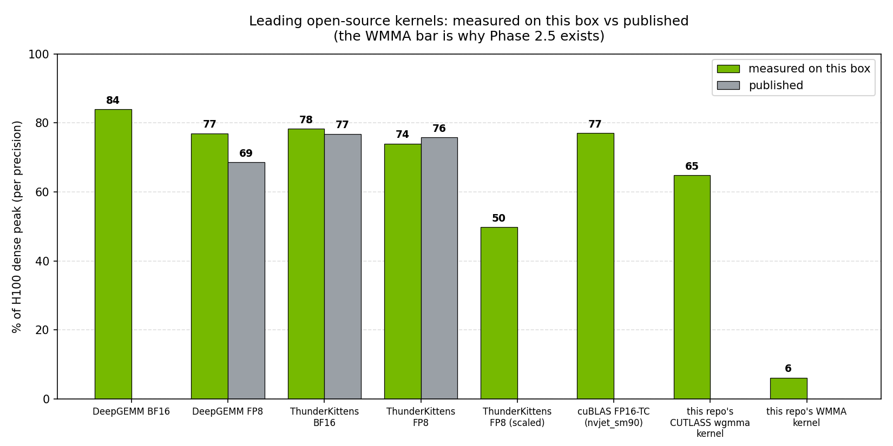

# Blackwell Tensor Core Kernels

Hand-written CUDA GEMM kernels targeting **Tensor Cores**, benchmarked on both **Hopper
(H100, sm_90)** and **Blackwell (RTX Pro 6000, sm_120)**, with a path toward Blackwell's
FP8/FP4 microscaling formats.

The point is to connect kernel-level choices — tiling, Tensor Core
fragment shapes, occupancy — to measured TFLOP/s as a fraction of the cuBLAS ceiling, on real
Hopper and Blackwell silicon.

## What this is
- A naive baseline, a shared-memory tiled GEMM, a **WMMA Tensor Core** GEMM, and a
  **hand-written raw `mma.sync` Tensor Core** GEMM ablation ladder (FP16 in / FP32 accumulate).
- A harness that checks correctness against cuBLAS and reports **TFLOP/s and % of the cuBLAS ceiling**,
  across a **precision ladder** of cuBLAS baselines on the same card:
  **`cublas`** = `cublasSgemm` (FP32, CUDA cores) → **`cublas_tf32`** = `cublasGemmEx` (FP32 in,
  TF32 compute, Tensor Cores) → **`cublas_tc`** = `cublasGemmEx` (FP16 in / FP32 acc, Tensor Cores —
  the same precision as the WMMA/mma.sync kernels, hence the honest ceiling).
- Builds for **sm_90 (H100)** and **sm_120 (Blackwell RTX Pro 6000)** so the same kernels *can* be
  profiled across two generations.

> **Measurement status:** both generations are now populated in `results/bench.csv` —
> **Blackwell RTX PRO 6000 Max-Q (sm_120)** and **H100 80GB SXM5 (sm_90)** (run on a separate
> 8×H100 box, pinned to a single idle GPU). Three headline findings:
>
> 1. **(Phase 2, sm_120)** A hand-written **raw `mma.sync` kernel reaches 106% of cuBLAS-TC on
>    sm_120** (243 vs 229 TFLOP/s @ 8192³) — beating the `cutlass_80` kernel cuBLAS dispatches
>    on this card, with the same standard-optimization stack Boehm used to reach ~94% on CUDA
>    cores. The WMMA wrapper, not the recipe, was what kept the Phase 1 kernel at 45%.
> 2. **(Phase 1)** The cross-generation comparison: **the same WMMA kernel that reaches 45% of
>    cuBLAS-TC on sm_120 reaches only 8% on H100** — not because the kernel runs slower per-SM,
>    but because Hopper's Tensor Core ceiling is only reachable through `wgmma` warpgroup
>    instructions that the WMMA API cannot emit.
> 3. **(Phase 2.5, sm_90)** That conclusion is now **closed constructively**: the same GEMM
>    rebuilt with CUTLASS 3.x (TMA + `wgmma`) reaches **85.5% of cuBLAS-TC on H100** — a 10.5×
>    recovery from the instruction class alone. Findings 1+3 are the same lesson on two
>    architectures: reach the *current* generation's native instruction or lose the ceiling.
>    Third-party ceilings (DeepGEMM, ThunderKittens, FlashAttention-3, Stream-K) are also
>    measured on this box as reference rows — all within ±12% of their published numbers.

## What this is NOT
- Not a cuBLAS replacement — cuBLAS is the ceiling measured against, honestly.
- Not tcgen05 — tensor-memory / CTA-pair instructions are sm_100 (B200) only. This card's
  FP8/FP4 path is the regular `mma` instruction set, and that is what Phase 3 measures.

## Hardware
- NVIDIA RTX Pro 6000 (Blackwell, sm_120) and/or H100 (Hopper, sm_90). CUDA 12.x+.

## Layout
```
src/gemm_naive.cu      # one-thread-per-output baseline (correctness anchor)
src/gemm_tiled.cu      # shared-memory tiled + register-blocked SIMT GEMM
src/gemm_wmma.cu       # WMMA 16x16x16 Tensor Core GEMM (FP16 in, FP32 acc)
src/gemm_mma.cu        # hand-written raw mma.sync m16n8k16 GEMM — 5-step ablation ladder (Phase 2)
src/cutlass_sm90.cu    # CUTLASS 3.x TMA + wgmma GEMM, Hopper only (Phase 2.5)
src/gemm_mma_fp8.cu    # FP8 (E4M3) / FP4 (E2M1) / MXFP4 GEMM via the sm_120 mma path (Phase 3)
src/cublaslt_fp8.cu    # cuBLASLt FP8 baseline — the library FP8 ceiling (Phase 3)
include/mma_ptx.cuh    # the PTX building blocks: mma.sync, ldmatrix, XOR swizzle, cp.async
src/reference.cu       # cuBLAS FP32 ceiling (cublasSgemm, CUDA cores)
src/cublas_tc.cu       # cuBLAS Tensor Core ceiling (cublasGemmEx, FP16 in / FP32 acc) — same precision as wmma/mma
src/main.cu            # correctness + benchmark driver -> results/bench.csv
include/util.cuh       # timing, init, max-abs-error check
scripts/sweep_mma_stages.sh  # cp.async pipeline-depth sweep -> results/mma_stage_sweep.csv
scripts/run_reference_benches.sh  # DeepGEMM / ThunderKittens / FA3 reference runs (Phase 4)
analysis/reference_summary.py     # parse reference logs -> summary.md + reference_benches.png
CMakeLists.txt         # builds for sm_90 and sm_120 (+ sm_90a CUTLASS via -DCUTLASS_DIR)
docs/design-decisions.md
docs/roadmap.md
```

## Quick start (on the Blackwell / H100 box)

One command does the full capture — size sweep + Nsight + plots + report:

```bash
make capture            # build -> sweep sizes -> ncu/nsys -> results/report.md + PNGs
```

The benchmark CSV records the **device and SM** of each run, so to compare both
generations you run the sweep **once on each GPU** and the rows accumulate:

```bash
# on the H100 box:           ARCH=90  make bench
# on the Blackwell box:      ARCH=120 make bench
make analyze                 # merge both -> results/report.md + results/tflops_sm*.png
```

Single run / one kernel, by hand:

```bash
make build
./build/gemm_bench 4096 4096 4096 results/bench.csv   # M N K [out_csv]
bash scripts/profile.sh 4096                           # ncu + nsys for gemm_wmma
```

## Results
`make capture` produces, in `results/`:

- `bench.csv` — per kernel × size × GPU: ms, TFLOP/s, **% of FP32 cuBLAS** (`pct_of_cublas`,
  vs `cublasSgemm`), max abs err. Now includes a `cublas_tc` row per size.
- `tflops_sm120.png`, `pct_tc_sm120.png`, `roofline_sm120.png` — the three charts below.
- `ncu_wmma_*.ncu-rep`, `nsys_*.nsys-rep` — Nsight Compute / Systems captures.
- `report.md` — the summary table (both **% of FP32 cuBLAS** and **% of cuBLAS-TC**) + charts.

### Measured on RTX PRO 6000 Blackwell Max-Q (sm_120, CUDA 12.8)

**Throughput across the precision ladder (FP32 → TF32 → FP16, all real, one card):**


**Each kernel as a fraction of the honest same-precision ceiling (cuBLAS FP16-TC = 100%):**


**Throughput at the largest (most steady-state) size, M=N=K=8192:**


The `gemm_wmma` kernel is shared-memory tiled with per-warp 2×2 register tiling and a 3-stage
`cp.async` pipeline, **size-dispatched**: 64×64 tile for N<1536 (better occupancy), 128×128 tile
for N≥1536 (more reuse). Numbers at each size (TFLOP/s and fraction of the **same-precision**
cuBLAS FP16-TC ceiling):

| size | wmma | tf32-TC | cublas_tc (FP16-TC) | **wmma % of cuBLAS-TC** | tf32 % of cuBLAS-TC |
|---|---|---|---|---|---|
| 512  | 16.2 | 28.0  | 33.3  | 48.7% | 84.0% |
| 1024 | 38.7 | 89.7  | 137.1 | 28.2% | 65.5% |
| 2048 | 68.7 | 131.3 | 215.7 | 31.8% | 60.9% |
| 4096 | 96.3 | 146.7 | 238.2 | 40.4% | 61.6% |
| 8192 | 103.5 | 152.7 | 229.2 | **45.2%** | 66.6% |

Read the **% of cuBLAS-TC** column — the honest same-precision (FP16-in/FP32-acc, Tensor Core)
ceiling. Across two optimization passes (shared-mem + cp.async, then register tiling + deeper
pipeline + size dispatch) the WMMA kernel went from a naive **17.3%** to **45.2%** of cuBLAS-TC
at 8192 (1.64× the single-buffer version), and no longer decays at scale. Pipeline depth is
tuned (3 stages > 4 > 5) and **warp specialization was tried but did not beat the multi-stage
pipeline** — the expected outcome per CudaDMA (Bauer et al., SC'11), since warp specialization
needs large tiles + async-transfer hardware + register reallocation as prerequisites, none of
which a 512-thread WMMA tile supplies on its own; see `results/nsys_profile.md` for the full
before/after and the WS experiment.
The **% of FP32 cuBLAS** column is precision-mismatched (kept for continuity); its `>100%` rows
are FP16-TC vs FP32-CUDA-core, not the kernel beating cuBLAS. `cublas_tc` is 4.2–23× faster than
`cublasSgemm`, confirming the Tensor Core path.

### Phase 2: hand-written mma.sync — past the WMMA ceiling, past cuBLAS (sm_120)

Phase 1 ended with a diagnosis: the WMMA kernel is **feed-bound** (MIO-queue-full), and the
fixes — swizzled shared memory, deeper register tiling — are exactly what the WMMA API hides.
Phase 2 tests that diagnosis constructively: rewrite the kernel on **raw
`mma.sync.aligned.m16n8k16` PTX + `ldmatrix`** (`src/gemm_mma.cu`), then re-apply the standard
optimization stack one step at a time — the same ablation discipline (and the same recipe) as
[Simon Boehm's FP32 ladder](https://siboehm.com/articles/22/CUDA-MMM), which reaches ~94% of
cuBLAS on CUDA cores. The roadmap question: does that recipe survive the move to Tensor Cores,
which consume operands ~8× faster?

**It does — and overshoots:**


| step | adds | TFLOP/s @ 8192³ | % of cuBLAS-TC |
|---|---|---|---|
| `wmma` (Phase 1 best) | – | 103.1 | 45.0% |
| `mma_base` | raw mma.sync + ldmatrix, 128×128 CTA, 2×2 warp tiling, scalar loads | 47.4 | 20.7% |
| `mma_swizzle` | + XOR-swizzled (bank-conflict-free) smem | 58.7 | 25.6% |
| `mma_vec` | + 16-byte vectorized `cp.async` | 165.3 | 72.2% |
| `mma_pipe` | + 2-stage pipeline (sweep winner: 2 > 3 > 4) | 178.0 | 77.7% |
| **`mma_warptile`** | **+ 64×64 per-warp register tile** | **243.2** | **106.1%** |
| `cublas_tc` (ceiling) | `cutlass_80_tensorop_s16816gemm_f16_128x64` | 229.0 | 100% |

Four things make the 106% credible (full validation in
[`results/mma_ablation.md`](results/mma_ablation.md)):
**(1)** identical `max_abs_err` to cuBLAS-TC at every size (same math, verified standalone);
**(2)** the gap is visible inside the GPU timeline — nsys shows 4.52 ms vs 4.79 ms per kernel
instance (`results/nsys_kern_sum_mma_8192.txt`); **(3)** it is a same-instruction contest —
cuBLAS's kernel name (`s16816`) says it uses the *same* `m16n8k16` instruction; we just tile and
pipeline it better for this card (128×128 CTA / 64×64 warp tile / 2 stages, 196 reg/thread,
0 spills); **(4)** ncu shows *why*: our kernel runs the Tensor pipe at **85.0%** utilization vs
cuBLAS's 74.0%, with the same top-stall signature ncu attributes to "already highly optimized
kernels" (`results/ncu_sm120_*_8192.txt`, captured via `scripts/profile_mma_ncu.sh`).

The ncu side-by-side also closes the Phase 1 → Phase 2 loop at the stall level:

| ncu @ 8192³ | wmma (Phase 1) | **mma_warptile (Phase 2)** | cuBLAS-TC (cutlass_80) |
|---|---|---|---|
| Tensor pipe utilization | 24.7% | **85.0%** | 74.0% |
| Warp cycles / issued instruction | 49.6 | **5.8** | 6.6 |
| Top stall | **MIO queue full (34.2%)** | fixed-latency dep (2.9 cyc) | fixed-latency dep (4.0 cyc) |
| Occupancy / registers | 65.3% / 64 | 16.6% / 186 | 8.3% / 154 |

The MIO-queue-full stall that defined the WMMA kernel is **gone**; the kernel now has the
low-occupancy / high-register / math-bound signature of the winning kernels — and runs its
Tensor pipe 11 points hotter than the kernel cuBLAS picked.

The honest framing: this beats **the kernel cuBLAS dispatches on sm_120** — an Ampere-era
CUTLASS kernel chosen by heuristics that don't yet have Blackwell-native FP16 tuning — not the
hardware peak. But that is precisely the repo's thesis demonstrated in reverse: *the ceiling on
any given card is set by which instruction class and tile shape the software can reach.* On
sm_120, raw `mma.sync` + the standard recipe reaches all of it. (On Hopper the same kernel would
cap at the ~63–65%-of-peak `mma.sync` instruction ceiling — `wgmma` territory, roadmap
Phase 2.5.)

What each step says (ablation reading, details in
[`results/mma_ablation.md`](results/mma_ablation.md)):
- **The baseline starts *below* WMMA on purpose** — every memory-path optimization is stripped
  so each can be priced separately. Raw Tensor Core instructions alone buy nothing (20.7%).
- **Vectorized `cp.async` is the biggest single jump (2.8×)** — on Tensor Cores, feed
  inefficiency is amplified ~8× vs Boehm's CUDA-core numbers.
- **Warptiling is the decisive step (77.7% → 106.1%)**, same as in Boehm's ladder (his: 78.4% →
  93.7%). 64×64 warp tiles double arithmetic intensity per `ldmatrix` (4:1 mma:ldmatrix vs
  2:1) — the direct fix for the Phase 1 MIO-queue-full stall.
- **The pipeline sweep flips vs WMMA**: 2 stages beat 3 (WMMA preferred 3). With ldmatrix
  feeding mma.sync directly, deeper buffering just costs occupancy.

### Phase 3: FP8 / FP4 — the Blackwell formats, through the sm_120 mma path

Same kernel skeleton as Phase 2 (128×128 CTA, 64×64 warp tile, swizzled smem, 2-stage
`cp.async`), with the instruction swapped per precision — `src/gemm_mma_fp8.cu`, built for
`sm_120a` (the FP4 kinds need it). tcgen05 is **not** available on this card (B200/sm_100
only); these are the precisions reachable through the plain `mma` path:

| kernel | format / instruction | TFLOP/s @ 8192³ | vs FP16 | max_abs_err |
|---|---|---|---|---|
| `mma_warptile` | FP16 · `m16n8k16` (HMMA) | 241.5 | 1.00× | 0.0112 |
| `mma_fp8` | FP8 E4M3 · `m16n8k32` (QMMA) | 503.7 | **2.09×** | 1.4 |
| `mma_fp4` | FP4-in-8bit · `kind::f8f6f4` (QMMA) | 520.5 | 2.16× | 5.97 |
| **`mma_mxfp4`** ¹ | **packed FP4 + block scale · `kind::mxf4` (OMMA.SF)** | **992.6** | **4.11×** | 5.97 |
| `cublas_tc` | FP16 (cuBLAS) | 226.9 | — | 0.0112 |
| `cublaslt_fp8` | FP8 E4M3 (cuBLASLt) | 553.5 | 2.29× | 1.4 |


The ladder delivers the 5th-gen Tensor Core spec almost exactly — **2.09× for FP8, 4.11× for
packed FP4** — and the Pareto chart shows the price: each 2× costs roughly a decimal digit
of accuracy (max_abs_err 0.011 → 1.4 → 6.0 at K=8192). Three findings worth quoting
(full analysis in [`results/phase3_lowprec.md`](results/phase3_lowprec.md)):

> ¹ **The 4.11× is a throughput result.** The MXFP4 block-scale factors are fed as 1.0 (UE8M0 =
> 127), i.e. per-tensor, not per-32-element-block, scaling — the hardware does identical work and
> the OMMA.SF rate is real, but the numerics do not exercise real per-block MXFP4 scaling (for the
> uniform test matrices per-block scales would be ≈ identical anyway; real-world activation
> outliers would widen the accuracy gap). See [`results/phase3_lowprec.md`](results/phase3_lowprec.md).

- **Unpacked FP4 is pointless.** `kind::f8f6f4` stores E2M1 in 8-bit containers and shares the
  QMMA pipeline → FP8 speed at 4× FP8's error. The 2×-over-FP8 exists only in the packed,
  block-scaled `kind::mxf4` path (OMMA.SF in SASS).
- **Our FP8 is 91.0% of cuBLASLt FP8** (504 vs 554) — and cuBLASLt's kernel uses the *same* tile,
  warp layout and instruction as ours. Larger tiles and deeper pipelines measured as dead ends;
  the gap is xmma's instruction-level scheduling. Register-pipelined fragments (this kernel's
  mainloop) buy 493 → 504; the last 9% needs finer interleaving.
- **cuBLAS has no FP4 GEMM on sm_120** (no public ceiling exists) — the 993 TFLOP/s MXFP4 row
  is this card's first-hand FP4 data point, at ~56% of the theoretical FP4 peak (a throughput
  data point — see footnote ¹ on the per-tensor block-scale caveat).

### Measured on H100 80GB SXM5 (sm_90, CUDA 13.1) — the cross-generation result

The same source, built with `ARCH=90`, run on one idle GPU of an 8×H100 box
(`nvcr.io/nvidia/pytorch:26.02-py3` container; the box's busy production GPU was never touched):


| size | wmma (TFLOP/s) | cublas_tc (TFLOP/s) | **wmma % of cuBLAS-TC** | same kernel on sm_120 |
|---|---|---|---|---|
| 2048 | 56.6 | 555.0 | 10.2% | 31.8% |
| 4096 | 59.4 | 732.6 | 8.1% | 40.4% |
| 8192 | 60.9 | 761.7 | **8.0%** | **45.2%** |

Two things happened at once, and `nsys`/`ncu` separate them cleanly
(see `results/nsys_profile.md` for the full profiles):

1. **The ceiling moved.** On H100, `cublas_tc` dispatches **`nvjet_sm90_hss_320x128`** — a
   Hopper-native warpgroup (`wgmma`) kernel that reaches **762 TFLOP/s ≈ 77% of H100's 989
   TFLOP/s FP16 dense peak**. On the RTX Pro 6000, cuBLAS-TC tops out at 229 TFLOP/s (an
   sm_80-style `cutlass_80_tensorop` kernel). The H100 ceiling is **3.3× higher** in absolute
   terms.
2. **Our kernel cannot follow it — for two stacked reasons.** (a) *Architectural*: the WMMA
   API lowers to per-warp `mma.sync`, and on Hopper `mma.sync` cannot reach the Tensor Core
   peak — instruction-level microbenchmarks (arXiv:2501.12084) measure the `mma` path at
   **~63–65% of peak** (494 of 757 TFLOPS on H800) vs **~96%** for `wgmma`. (b) *Kernel*: our
   kernel doesn't even reach that mma.sync ceiling — it reaches 6% of peak, because its
   shared-memory operand pipeline (tile sizes and 3-stage `cp.async` depth tuned on sm_120,
   where the Tensor Cores are 3.3× slower) cannot feed Hopper's TCs; the ncu profile below
   shows it is MIO/feed-bound, not math-bound. Closing (b) with Hopper-tuned staging would
   still leave (a) — the wgmma-only gap to cuBLAS.

`ncu --set full` on both kernels at 8192³ quantifies the gap (full table in
`results/nsys_profile.md`):

| metric (ncu, 8192³) | `gemm_wmma_t<128,128,3>` (ours) | `nvjet_sm90` (cuBLAS-TC) |
|---|---|---|
| Duration | 22.9 ms | 1.56 ms |
| SM compute throughput | 26.7% | **91.9%** |
| DRAM throughput | 6.2% | 28.9% |
| Achieved occupancy | 49.4% | **14.8%** |
| Registers / thread | 64 | 168 |
| Top stall reason | MIO queue full (shared-mem traffic) | WARPGROUP.ARRIVES (wgmma sync) |

The signature is unmistakable: the winning kernel runs at **low occupancy with huge register
state and near-peak tensor utilization** (the warpgroup model), while the WMMA kernel burns its
issue slots on shared-memory `ld`/`st` (MIO stalls) feeding fragments to `mma.sync` — high
occupancy, low utilization.

**What transfers across generations and what doesn't:** the optimization *story* (tiling,
`cp.async` pipelining, register tiling) transfers — the kernel's absolute TFLOP/s scales only
with SM count × clock (103 vs 61 TFLOP/s; the spec SM×clock ratio is 1.88×, measured 1.70× —
the Max-Q power limit accounts for the difference). What does **not** transfer is the
*fraction of the ceiling*:
each architecture generation moves the ceiling behind a new instruction (Volta `mma.sync` →
Ampere `mma.sync`+`cp.async` → Hopper `wgmma`+TMA → Blackwell `tcgen05`), and a kernel written
against the previous generation's abstraction silently keeps its absolute speed while losing
its relative one. That is the actual lesson an SA needs when a partner asks "why is my custom
kernel slow on the new GPUs?"

> ### On the two cuBLAS baselines (read before quoting any "% of cuBLAS")
> **% of FP32 cuBLAS** (e.g. 1125% @ 512, 189% @ 8192) compares **FP16-on-Tensor-Cores WMMA** against
> **`cublasSgemm` FP32 on CUDA cores** — precision-mismatched, **not** a Tensor Core ceiling; a `>100%`
> row reflects that mismatch (plus small-size launch overhead), not a kernel beating cuBLAS.
> **% of cuBLAS-TC** compares against **`cublas_tc` (`cublasGemmEx`, FP16 in / FP32 accumulate)** in
> `src/cublas_tc.cu` — same precision, same timing methodology (FP16 cast staged once outside the timed
> loop; cuBLAS handle created once). Against this honest ceiling the optimized WMMA lands at ~45% at
> large sizes. **The remaining gap is *not* TMA or warp specialization** — nsys shows cuBLAS
> dispatches `cutlass_80_tensorop_s16816gemm_f16_128x64`, an **Ampere-generation (sm_80) kernel**
> that uses `cp.async` multistage pipelining, *not* TMA and *not* warp specialization (both are
> sm_90/Hopper+ features). The gap comes from cuBLAS's larger 128×64 CTA tile, deeper
> register-level warp/thread tiling, vectorized loads, swizzle/rasterization, and more aggressive
> multistage `cp.async` pipelining — the kernel-name string itself (`cutlass_80_*`) is the
> evidence. This is consistent with Boehm's published GEMM ablation, where 2D blocktiling +
> vectorized loads + warptiling reaches ~94% of cuBLAS *without* TMA or warp specialization.

### Phase 2.5 — breaking the WMMA ceiling with CUTLASS 3.x `wgmma` (constructive proof)

The H100 result above says the WMMA API *cannot* follow Hopper's ceiling. That conclusion
rested on literature + ncu evidence; this closes it constructively. `src/cutlass_sm90.cu`
builds the same FP16-in/FP32-accumulate GEMM with CUTLASS 3.x's `CollectiveBuilder`
(TMA loads + `wgmma` warpgroup MMA, warp-specialized cooperative schedule), added as kernel
row `cutlass_sm90` (build: `cmake -DCMAKE_CUDA_ARCHITECTURES=90a -DCUTLASS_DIR=…`; raw rows
in `results/bench_sm90a.csv`, same one-idle-H100 methodology):

| size | wmma | **cutlass_sm90** | cublas_tc (nvjet) | cutlass % of cuBLAS-TC | wmma % |
|---|---|---|---|---|---|
| 2048 | 56.0 | **373.9** | 540.9 | 69.1% | 10.4% |
| 4096 | 58.9 | **552.7** | 726.4 | 76.1% | 8.1% |
| 8192 | 61.0 | **640.9** | 749.9 | **85.5%** | 8.1% |

Switching instruction class (`mma.sync` → `wgmma`) recovers **10.5×** at 8192³ — from 8% to
85.5% of the cuBLAS-TC ceiling — with identical numerical error (0.0112 max abs, FP16 input
rounding). The `ncu --set full` signature confirms the kernel actually crossed regimes
(`results/ncu_cutlass_8192.txt`):

| metric (ncu, 8192³) | wmma (ours) | **cutlass_sm90 (ours)** | nvjet (cuBLAS-TC) |
|---|---|---|---|
| SM compute throughput | 26.7% | **74.4%** | 91.9% |
| Achieved occupancy | 49.4% | **14.1%** | 14.8% |
| Registers / thread | 64 | **168** | 168 |
| Top stall reason | MIO queue full (memory feed) | **CTA barrier (warpgroup sync)** | WARPGROUP.ARRIVES |

The CUTLASS kernel inherits nvjet's *shape*: low occupancy, 168 registers/thread, stalls on
warpgroup synchronization instead of operand feeding. The remaining 14.5% to nvjet is
tile-shape/cluster/rasterization autotuning (nvjet picks 320×128 tiles vs our fixed 128×256) —
a tuning gap, not an instruction-class gap. Also note the reversal this documents: warp
specialization, a measured *negative* on sm_120 (`experiments/wmma_ws_probe.cu`), is
*mandatory* on Hopper.

### Third-party reference baselines on this box (Phase 4)

What do the leading open-source kernels actually achieve on *this* H100, run with their own
benchmarks, unmodified? (`scripts/run_reference_benches.sh`; raw logs + clock state in
`results/reference/`; parsed by `analysis/reference_summary.py`)



| kernel | measured TFLOPS | % of H100 peak | published | measured / published |
|---|---|---|---|---|
| DeepGEMM FP8 (DeepSeek) | **1523** | 77% | 1358 (H800) | **112%** |
| DeepGEMM BF16 | 830 | 84% | — | — |
| ThunderKittens FP8 | **1465** | 74% | ~1500 | **98%** |
| ThunderKittens BF16 | 775 | 78% | ~760 | 102% |
| ThunderKittens FP8 (per-block scaled) | 985 | 50% | — | — |
| FlashAttention-3 FP16 fwd | **757** | 77% | 740 | **102%** |
| *FlashAttention-2 fwd (same file), context* | *388* | *39%* | — | — |
| *cuDNN attention fwd (same file), context* | *689* | *70%* | — | — |
| *cuBLAS FP16-TC (nvjet), context* | *750* | *76%* | — | — |
| *this repo's WMMA kernel, context* | *61* | *6%* | — | — |
| *this repo's CUTLASS wgmma kernel, context* | *641* | *65%* | — | — |

Two readings: (1) the published numbers are *honest* — every project reproduces within ~±10%
on our shared box at stock clocks, so the repo's own gaps are real, not environmental;
(2) the FP8 ceiling (~1500 TFLOPS measured) is the target Phase 3's own FP8 kernel work
gets measured against.

One published claim that does **not** reproduce: **Stream-K's "up to 6.7×"**
(arXiv:2301.03598). CUTLASS example 47 on this H100 lands at **0.94×–1.05×** vs data-parallel
tiling, even on shapes built to have a 48%-idle final wave (`results/reference/streamk.txt`).
The 6.7× was measured on A100 (108 SMs) against constructed worst cases; H100's 132 SMs shrink
the relative tail, and the Stream-K reduction overhead eats what remains. Negative
reproductions are reported as such — that is what the reference rows are for.

## References
- [NVIDIA CUTLASS](https://github.com/NVIDIA/cutlass) — the production reference for Tensor Core GEMM.
- [WMMA API (CUDA C++ Programming Guide)](https://docs.nvidia.com/cuda/cuda-c-programming-guide/index.html#wmma) — the API used by `gemm_wmma.cu`.
- [Simon Boehm, "How to Optimize a CUDA Matmul Kernel"](https://siboehm.com/articles/22/CUDA-MMM) — quantified step-by-step ablation: 2D blocktiling alone reaches 68.7% of cuBLAS, +vectorized loads 78.4%, +warptiling 93.7%, all without TMA or warp specialization.
- [CudaDMA: Optimizing GPU Memory Bandwidth via Warp Specialization (Bauer et al., SC'11)](https://research.nvidia.com/publication/2011-11_cudadma-optimizing-gpu-memory-bandwidth-warp-specialization) — origin of warp specialization; it pays off only with large tiles + async memory hardware + register reallocation.
- [CUTLASS Efficient GEMM docs](https://docs.nvidia.com/cutlass/latest/media/docs/cpp/efficient_gemm.html) — CTA/warp/thread tiling, multistage pipelining, and kernel naming.

## Disclaimer
Personal project for learning and benchmarking. Views and results are my own and do not represent any employer.
