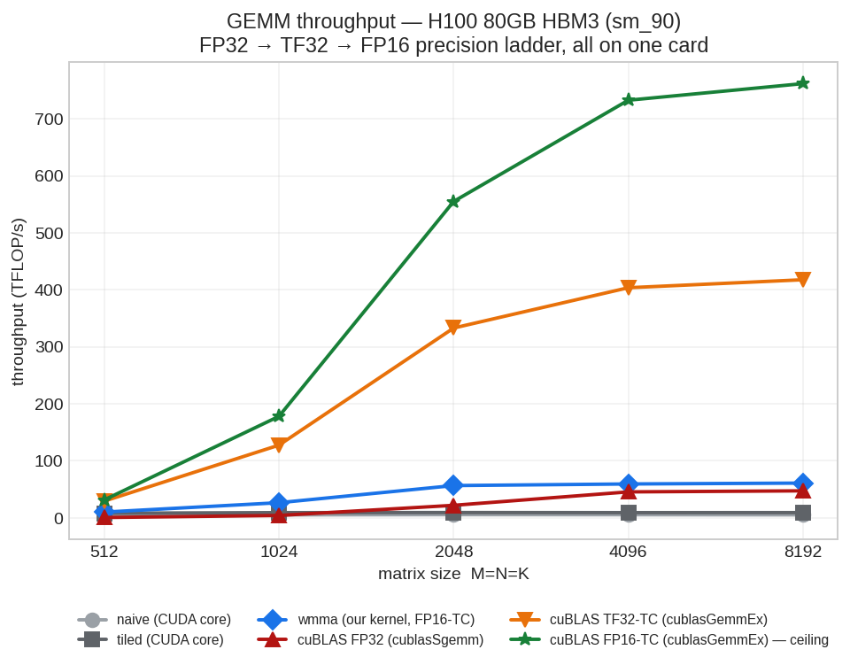
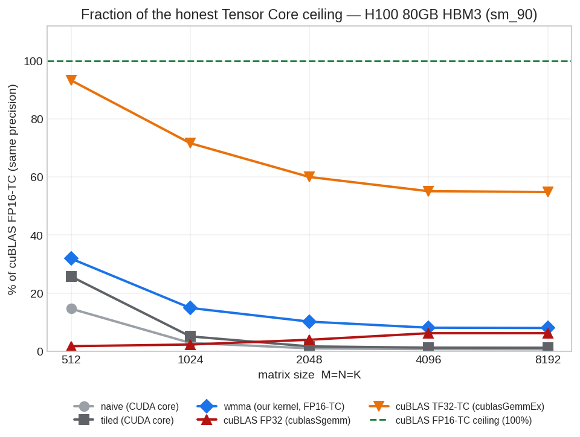
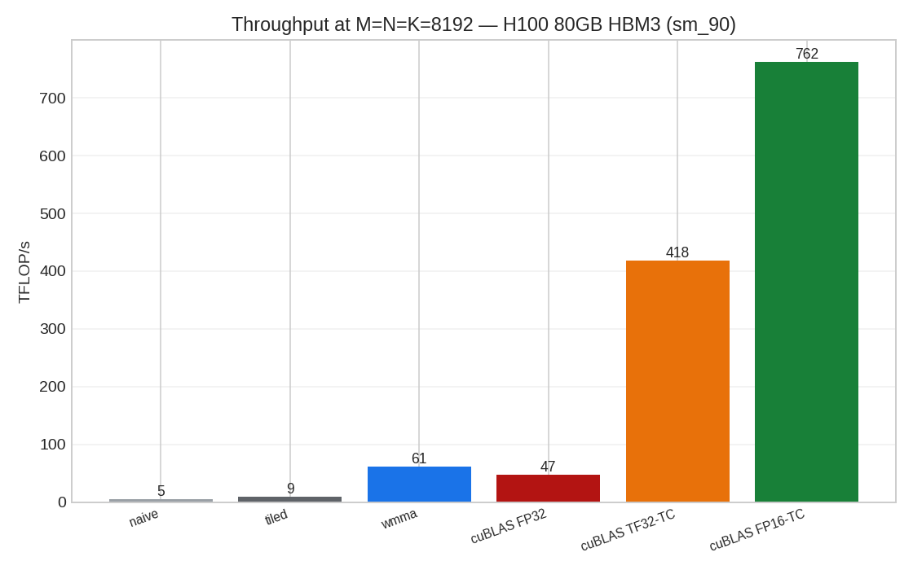
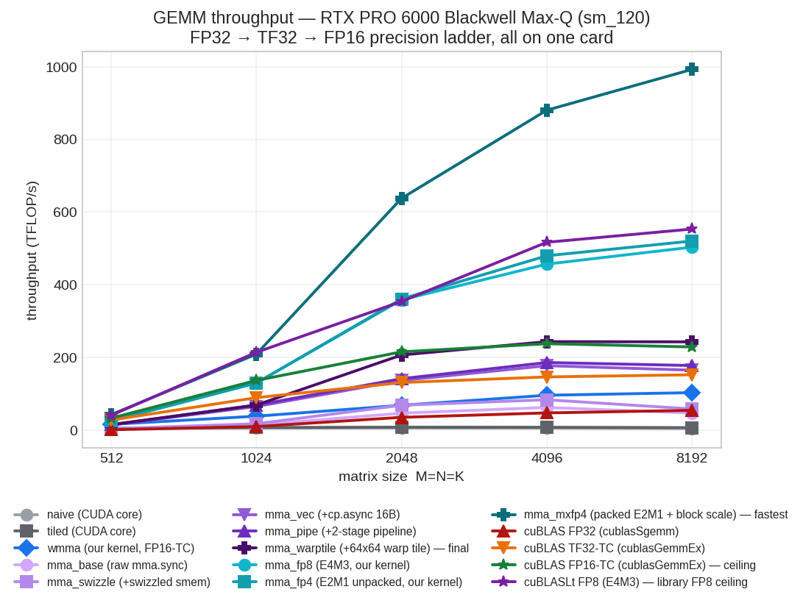
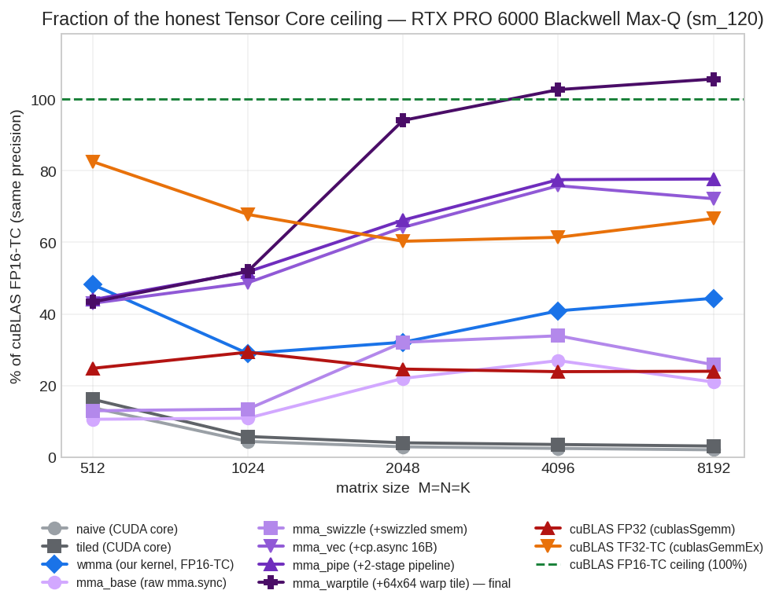
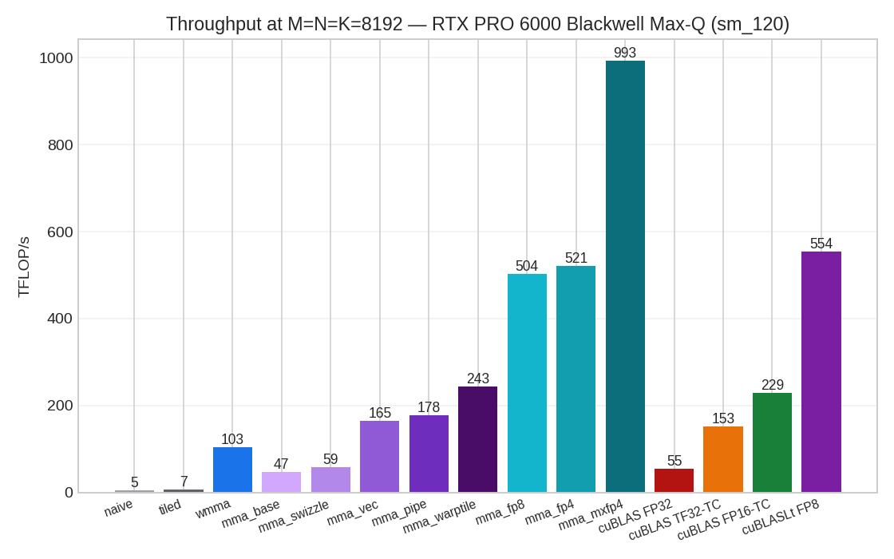
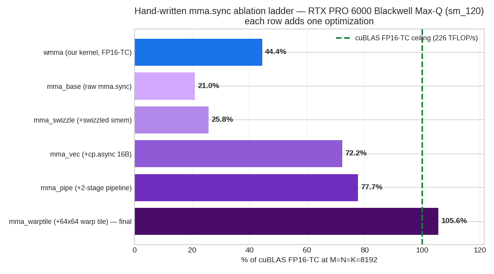
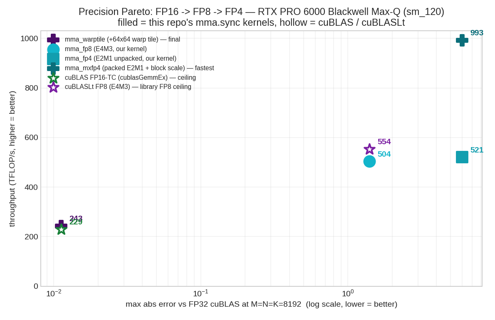

# Blackwell vs Hopper Tensor Core GEMM — results

## NVIDIA H100 80GB HBM3 (sm_90)

At M=N=K=8192:

| kernel | TFLOP/s | % of FP32 cuBLAS | % of cuBLAS-TC | max abs err |
|---|---|---|---|---|
| naive | 5.2 | 10.9% | 0.7% | 0 |
| tiled | 9.2 | 19.4% | 1.2% | 0 |
| wmma | 60.9 | 128.7% | 8.0% | 0.0112 |
| cublas | 47.3 | 100.0% | 6.2% | 0 |
| cublas_tf32 | 417.6 | 882.3% | 54.8% | 0.0113 |
| cublas_tc | 761.7 | 1609.2% | 100.0% | 0.0112 |

> Precision ladder, all on the **same card**: **cublas** = `cublasSgemm` (FP32, CUDA cores); **cublas_tf32** = `cublasGemmEx` (FP32 in, TF32 compute, Tensor Cores); **cublas_tc** = `cublasGemmEx` (FP16 in / FP32 acc, Tensor Cores) — the honest same-precision ceiling for `wmma`. **% of FP32 cuBLAS** is precision-mismatched (FP16/TF32-TC vs FP32-CUDA-core), so its `>100%` rows are **not** a kernel beating cuBLAS. Quote **% of cuBLAS-TC**.

## NVIDIA RTX PRO 6000 Blackwell Max-Q Workstation Edition (sm_120)

At M=N=K=8192:

| kernel | TFLOP/s | % of FP32 cuBLAS | % of cuBLAS-TC | max abs err |
|---|---|---|---|---|
| naive | 4.8 | 8.7% | 2.1% | 0 |
| tiled | 7.3 | 13.3% | 3.2% | 0 |
| wmma | 103.5 | 188.7% | 45.2% | 0.0112 |
| mma_base | 47.4 | 86.3% | 20.7% | 0.0112 |
| mma_swizzle | 58.6 | 106.9% | 25.6% | 0.0112 |
| mma_vec | 165.3 | 301.3% | 72.1% | 0.0112 |
| mma_pipe | 178.0 | 324.5% | 77.7% | 0.0112 |
| mma_warptile | 243.2 | 443.3% | 106.1% | 0.0112 |
| mma_fp8 | 503.7 | 0.0% | 219.8% | 1.4 |
| mma_fp4 | 520.5 | 0.0% | 227.1% | 5.97 |
| mma_mxfp4 | 992.6 | 0.0% | 433.1% | 5.97 |
| cublas | 54.8 | 100.0% | 23.9% | 0 |
| cublas_tf32 | 152.7 | 278.4% | 66.6% | 0.0113 |
| cublas_tc | 229.2 | 417.9% | 100.0% | 0.0112 |
| cublaslt_fp8 | 553.5 | 0.0% | 241.5% | 1.4 |

> Precision ladder, all on the **same card**: **cublas** = `cublasSgemm` (FP32, CUDA cores); **cublas_tf32** = `cublasGemmEx` (FP32 in, TF32 compute, Tensor Cores); **cublas_tc** = `cublasGemmEx` (FP16 in / FP32 acc, Tensor Cores) — the honest same-precision ceiling for `wmma`. **% of FP32 cuBLAS** is precision-mismatched (FP16/TF32-TC vs FP32-CUDA-core), so its `>100%` rows are **not** a kernel beating cuBLAS. Quote **% of cuBLAS-TC**.

